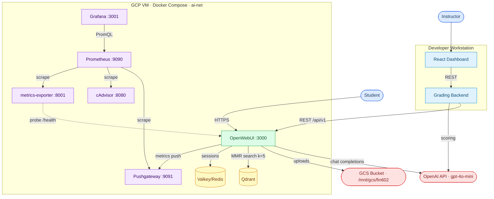

# FamilyFinanceChat — Capstone Demo Brief

> Source of truth: production code as of April 2026. READMEs and docs treated as supplementary.

---

## 1. Architecture Analysis

### Services (Docker Compose on GCP VM)

| Service | Image | Host Port | Role |
|---|---|---|---|
| `open-webui` | custom build `ghcr.io/open-webui/open-webui:v0.8.12` | **3000** | Chat UI, LLM routing, user auth, chat history; 2 CPU / 10 GB RAM limit |
| `qdrant` | `qdrant/qdrant:latest` | **none** (internal only) | Vector database for Chroma RAG collections |
| `redis` | `valkey/valkey:8.0.1-alpine` | **none** (internal only) | WebSocket sessions; 256 MB maxmemory LRU, 512 MB container limit |
| `prometheus` | `prom/prometheus:v2.51.2` | **9090** | Time-series metrics DB, 30-day retention |
| `pushgateway` | `prom/pushgateway:v1.8.0` | **9091** | HTTP push endpoint for OpenWebUI filter function |
| `cadvisor` | `gcr.io/cadvisor/cadvisor:latest` | **8080** | Container CPU/memory metrics |
| `grafana` | `grafana/grafana:9.0.0` | **3001** | Dashboards (default creds: admin/admin) |
| `metrics-exporter` | custom FastAPI | **8001** (→ internal 8000) | Probes OpenWebUI `/health` every 15s; exposes `/metrics` for Prometheus |

**Notable volume mounts:**
- `open-webui`: `/mnt/gcs/fin602 → /app/backend/data/uploads` — file uploads route to a GCS bucket mounted on the VM
- `open-webui`: `/opt/openwebui/data → /app/backend/data` — persistent SQLite DB and config
- `qdrant`: `/opt/qdrant/storage` — vector index on disk
- `prometheus`: `/opt/prometheus/data` — 30-day time-series store
- `grafana`: `/opt/grafana/data` — dashboard and datasource config

All containers share bridge network `ai-net`. A staging stack (`docker-compose.staging.yml`) and a test stack (`docker-compose.test.yml`, port 3003) mirror this topology with suffixed container names and isolated networks.

The grading dashboard (FastAPI backend + React/Vite frontend) runs **locally on a developer workstation** and connects to the VM. It is not containerized in the current stack.

**What Prometheus actually scrapes** (per `prometheus.yml`):

| Job | Target | What it collects |
|---|---|---|
| `openwebui-exporter` | `metrics-exporter:8000` | OpenWebUI `/health` probe latency + uptime |
| `cadvisor` | `cadvisor:8080` | Container CPU, memory, network |
| `pushgateway` | `pushgateway:9091` | Chat metrics pushed by filter function |
| `openwebui-exporter-staging` | `metrics-exporter-staging:8000` | Same, staging instance |
| `pushgateway-staging` | `pushgateway-staging:9091` | Same, staging instance |

Prometheus does **not** scrape OpenWebUI directly — there is no `open-webui` scrape target.

### LLM

- **Model:** `gpt-4o-mini` via OpenAI API (`https://api.openai.com/v1`)
- Configured through OpenWebUI environment: `OPENAI_API_KEY`, `OPENAI_BASE_URL`, `OPENAI_MODEL`
- Scoring calls use `temperature=0` for determinism; RAG calls use `temperature=0.2`
- Multi-provider support coded (`qwen-plus` via DashScope, `qwen2:7b` via Ollama) but Ollama is commented out in production compose

### RAG Pipeline

```
Source documents (PDF / TXT / URL)
  └─ Loader (deduplicated, type-detected)
       └─ Type-aware splitter
            PDF:  chunk_size=1000, overlap=150
            TXT:  chunk_size=800,  overlap=100
            Web:  chunk_size=800,  overlap=100
       └─ Embeddings
            Default: BAAI/bge-m3 (HuggingFace, local, no API key)
            Optional: text-embedding-3-small (OpenAI)
       └─ Chroma vector store (Qdrant backend)
            Collections named: {username}_{character}
       └─ MMR retrieval  k=5, fetch_k=15
            Strictness thresholds: strict=0.70 / medium=0.60 / loose=0.50
       └─ Prompt template (auto-selected by query keywords)
            rag_concise          — default (3-sentence max)
            rag_with_citations   — triggered by "cite / citation / source"
            rag_comparison       — triggered by "compare / vs / difference"
            rag_timeline         — triggered by "timeline / when / history"
            rag_extraction       — triggered by "extract / structured / json"
            contextualize_question — multi-turn with chat history
       └─ LLM → answer returned to OpenWebUI
```

RAG documents confirmed present in the repo: `rag_bio_project/data_pdfs/` contains `FIN602 Client Data 2025.pdf`, `liqing.pdf`, `wangmu.pdf`. A built Chroma index (`rag_bio_project/index/`) is also checked in.

### Analytics Pipeline

```
Student sends a message
  └─ OpenWebUI inlet hook (chat_metrics_filter.py)
       Records: start_time, message_count, estimated_tokens, model
  └─ LLM call
  └─ OpenWebUI outlet hook
       Computes: elapsed_seconds, extracts prompt_tokens, completion_tokens
       POSTs Prometheus text format to Pushgateway (http://pushgateway:9091)

Prometheus (scrape interval: 15s)
  └─ Scrapes: Pushgateway, cAdvisor, metrics-exporter
  └─ Stores 30 days of time-series data

Grafana (port 3001)
  └─ Queries Prometheus via PromQL
  └─ Panels: chat latency, token usage, container resources, uptime
```

**Metrics pushed per chat:**
- `openwebui_chat_completion_seconds` — total round-trip time
- `openwebui_chat_context_length` — message count in context
- `openwebui_context_tokens_estimated` — chars ÷ 4
- `openwebui_llm_prompt_tokens` — actual prompt tokens (when available)
- `openwebui_llm_completion_tokens` — actual completion tokens (when available)

All metrics labeled by `model`.

**The Chat Metrics filter is not auto-deployed.** It must be manually installed in OpenWebUI Admin > Workspace > Functions after each new deployment.

---

## 2. Feature Summary

### Working Features (confirmed by source code)

**Chat Interface**
- Multi-model chat via OpenAI API, real-time via WebSocket (Redis backend)
- User authentication and role-based access control
- Chat history persistence (SQLite inside OpenWebUI container)
- Known issue: chat may hang after 7+ messages in a single session; workaround is to open a new chat

**RAG — Retrieval-Augmented Generation**
- Multi-source document ingestion: PDF, TXT, web URLs
- Type-aware text splitting with per-format profiles
- Locally-run BGE-M3 embeddings (no external API key required)
- MMR retrieval with configurable similarity thresholds
- Auto-routing across per-user/per-character collections
- Auto-selected prompt templates based on query intent

**Question Quality Scoring**
- Extracts student questions from chat transcripts using keyword/punctuation heuristics
- Scores 7 dimensions (0–2 each): relevance, politeness, on_topic, neutrality, non_imperative, clarity (optional), privacy_minimization (optional)
- Total score 0–14, normalized to 0–100
- Distribution histogram across four bands: 0–3, 4–6, 7–10, 11–14
- Per-question table with full dimension breakdown

**ABI Trust Scoring**
- Ability, Benevolence, Integrity framework with 12 sub-dimensions
- Stage-based trust evolution: CONTRACT → KNOWLEDGE → EMPATHY
- Stage transitions gated by numeric thresholds (I ≥ 0.70, B ≥ 0.70, etc.)
- Runs post-hoc via the grading dashboard backend, not as a live OpenWebUI filter
- Supports OpenAI-backed scoring or deterministic mock mode

**Grading Dashboard** (FastAPI + React/Vite)
- `GET /users` — list all students with chat counts
- `GET /refresh` — pull latest data from OpenWebUI REST API
- `POST /api/score` — score a list of questions, optional ABI
- `GET /api/student-feedback` — per-student or aggregate feedback synthesis
- Frontend pages: Home (metric cards, top-users chart, chats-per-day chart), User Detail (chat transcripts with drawer), Scoring (upload JSON, score, paginate), Student Feedback (per-student performance band + synthesized feedback)

**Monitoring**
- Prometheus + Grafana fully wired
- Chat metrics via Pushgateway filter (manual install required)
- Container metrics via cAdvisor
- OpenWebUI health probing via metrics-exporter sidecar

**Multi-Environment Support**
- Production, staging, and test stacks each isolated with separate containers, networks, and ports

### Disabled or Incomplete

| Item | Status |
|---|---|
| Ollama local model | Commented out in `docker-compose.yml` |
| RAG web search | `ENABLE_RAG_WEB_SEARCH=false` |
| Reranking model | `RAG_RERANKING_MODEL` left empty |
| Chat Boundary Metrics filter | Referenced by name but no source file exists in the repo |
| ABI as live OpenWebUI filter | Not implemented; ABI runs only as a post-hoc batch scorer |
| Grading dashboard containerized | Runs locally; not in the Docker Compose stack |
| SQLite fallback extraction | TODO comment in `extract_chats.py`, not implemented |

---

## 3. Demo Flow Recommendation

**Prerequisite prep (before demo day):**
- Confirm Chat Metrics filter is installed and globally enabled in OpenWebUI Admin > Workspace > Functions
- Confirm family scenario PDFs are loaded into the Qdrant/Chroma knowledge base on the production instance
- Prepare a sample `students.json` export (or use a real export) ready to paste into the scoring page
- Keep each demo chat under 6 messages to avoid the hang bug

**Sequence (2–3 minutes):**

**0:00–0:25 — Setup context**
Show the OpenWebUI login screen. Say: "Students in FIN 602 practice financial advising against AI role-players. No scheduling required, no human role-player availability constraints."

**0:25–1:20 — Live chat + RAG**
Send: *"What should I consider when structuring a trust for a wealthy family with multiple generations?"*
- Show the answer appearing with retrieved document references
- Send: *"Compare trust structures for married vs. unmarried couples."*
- Show the comparison prompt template kick in, citations inline

**1:20–1:55 — Scoring**
Open the grading dashboard Scoring page. Paste or upload the pre-prepared student JSON. Click "Score Questions." Show the 7-dimension breakdown per question. Toggle ABI mode on and show Ability / Benevolence / Integrity scores appear.

**1:55–2:25 — Student Feedback**
Switch to the Student Feedback page. Show a per-student performance band and the synthesized feedback summary (e.g., "Needs improvement: staying on topic, framing questions as questions rather than commands").

**2:25–3:00 — Monitoring (optional / if time)**
Flip to Grafana on a second monitor. Point out the chat latency panel and token usage trend. One sentence: "Everything the students just did is logged, timestamped, and queryable."

---

## 4. Presentation Talking Points

### Problem
FIN 602 students need structured practice in financial advising before working with real clients. Scheduling human role-players creates bottlenecks, and feedback is inconsistent across sessions.

### Who It's For and Why It Matters
Wealth management students get unlimited, on-demand AI practice sessions grounded in real course scenarios. Instructors get automated scoring and feedback synthesis instead of reading every chat transcript manually.

### How It Works (jargon-light)
Students chat with an AI advisor pre-loaded with family financial scenarios. Before each answer, the system retrieves the most relevant knowledge from course documents, keeping responses grounded rather than hallucinated. After practice sessions, a scoring engine analyzes student questions across seven quality dimensions and a trust rubric, producing per-student performance reports automatically. A monitoring stack tracks response times and token usage in real time so the team can spot issues before students do.

### What We Built This Semester
- Upgraded OpenWebUI from v0.6.41 to v0.8.12 and decoupled from the vendor fork
- Implemented ABI Trust Scoring with stage-based evolution (CONTRACT → KNOWLEDGE → EMPATHY)
- Built the React grading dashboard: Home analytics, User Detail, Scoring, and Student Feedback pages
- Added Prometheus + Pushgateway + Grafana observability pipeline
- Created multi-environment prod/staging/test Docker stacks
- Added API refresh endpoint and structured JSON export for chat data with role-based filtering

### What Comes Next
- Host the grading dashboard on the VM behind Nginx with basic auth so professors don't need SSH
- Wire the `/ready` endpoint into GCP uptime monitoring with alerting
- Add streaming output to reduce perceived latency
- Build per-institution container recipe for multi-tenant expansion beyond FIN 602
- Add CI/CD with post-upgrade smoke tests to catch custom code breaks automatically

---

## 5. Architecture Diagram

### Recommended tool

Use **draw.io** (free, at diagrams.net) for the presentation slide — it exports clean PNG/SVG, supports GCP icons, and requires no account. For version-controlled or GitHub-rendered diagrams, the Mermaid source below is authoritative and renders natively on GitHub and in VS Code with the Mermaid Preview extension.

### Color legend

| Color | Tier |
|---|---|
| Blue | Human actors (Student, Instructor) |
| Green | Core application (OpenWebUI) |
| Yellow | Data stores (Qdrant, Valkey/Redis) |
| Purple | Observability stack (Pushgateway, Prometheus, cAdvisor, metrics-exporter, Grafana) |
| Red | External services outside your infrastructure (OpenAI API, GCS) |
| Light blue | Instructor grading tools (React Dashboard, Grading Backend) |

### Mermaid source



### How to use this in draw.io

1. Go to [diagrams.net](https://diagrams.net) → **Create New Diagram**
2. Menu → **Extras → Edit Diagram**
3. Paste the Mermaid source above
4. draw.io will render it as an editable flowchart — rearrange nodes, apply GCP icon shapes, and style as needed
5. Export as PNG (File → Export As → PNG, 2x scale for sharpness)

### What every element represents

| Element | What it is |
|---|---|
| Student Browser | Any student on the platform; connects via public IP on port 3000 |
| Instructor Browser | Professor/TA; connects to the grading dashboard running on their local machine |
| OpenWebUI :3000 | Core application — serves the chat UI, routes LLM calls, manages users and chat history in SQLite |
| Qdrant (internal) | Stores BGE-M3 embedding vectors; no host port — only OpenWebUI reaches it |
| Valkey/Redis (internal) | Holds WebSocket session state; no host port — only OpenWebUI reaches it |
| GCS bucket | Persistent file uploads (PDFs, documents) mounted at `/mnt/gcs/fin602` on the VM |
| OpenAI API | Receives chat completions (OpenWebUI) and scoring requests (grading backend); both use gpt-4o-mini |
| Pushgateway :9091 | Receives chat metrics pushed by the OpenWebUI filter function after each conversation turn |
| Prometheus :9090 | Scrapes Pushgateway, cAdvisor, and metrics-exporter every 15s; stores 30 days of data |
| cAdvisor :8080 | Reports Docker container CPU, memory, and network usage to Prometheus |
| metrics-exporter :8001 | Probes OpenWebUI `/health` every 15s; reports `openwebui_up`, probe latency, and request counts |
| Grafana :3001 | Visualizes all Prometheus data via PromQL-powered dashboards |
| Grading Backend | FastAPI app; pulls chat data from OpenWebUI REST API, runs question scoring and ABI pipeline |
| React Dashboard | Vite frontend; calls the grading backend for user lists, scoring results, and student feedback |

---

## 6. Open Questions

These could not be determined from the code alone. Confirm with teammates before the presentation.

| # | Question | Why It Matters |
|---|---|---|
| 1 | **Chat hang after 7+ messages** — is this a known OpenWebUI v0.8.12 bug, a token-limit issue, or something in the filter function? | Demo safety: keep chats short or show it's fixed |
| 2 | **Chat Boundary Metrics filter** — no source file exists. Was it built and installed directly into OpenWebUI without being committed to the repo, or is it planned but not yet built? | Affects what you can honestly claim is running |
| 3 | **ABI filter** — is there a live OpenWebUI filter version of ABI scoring, or does it only run post-hoc via the grading dashboard? | Affects your demo script and architecture diagram |
| 4 | **Chat Metrics filter installation** — is `chat_metrics_filter.py` currently installed and globally enabled on the production OpenWebUI instance? | Without it, Grafana shows no chat metrics |
| 5 | **Knowledge base on production** — are the family scenario PDFs loaded into the production Qdrant instance? The files exist locally in `rag_bio_project/data_pdfs/` but RAG requires them to be embedded and stored in the running Qdrant container | Core demo flow breaks if not loaded |
| 6 | **ABI scoring: rule-based or trained?** — the pipeline uses weighted formulas and OpenAI as the sub-dimension scorer. Is there any training on real student data, or is it a heuristic rubric? | Will be asked in Q&A |
| 7 | **Grading dashboard location for demo** — is it running on the VM or on a local machine? If local, confirm the VM API URL is reachable and auth tokens are valid | Logistics for the live demo |
| 8 | **Pre-loaded demo data** — do you have a realistic `students.json` export ready to paste into the scoring page? If the production instance has no real student data yet, you need a synthetic example prepared | Scoring demo will be blank otherwise |
| 9 | **Staging vs. production for demo** — which instance are you demoing against? Staging (separate containers, separate data) or production? | Determines which URLs and credentials to use |
