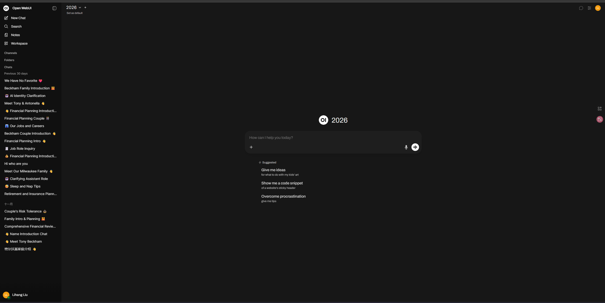

# Setting up openwebui

# 1. Login:

The professor or the other admins would have permissions to set up your accounts. Method would be explained later. After the login, the page should look like this.

## Basic introduction of areas:

Workspace is the place you edit models, and knowledge base.

Besides the workspace area, there is a place which you can switch to different models.

Admins can go into the admin panel by clicking the button with you initials on the top right corner.

# 2. Editing Users

The admin panel page should look like this 

By clicking the + button on the top right, you can add users by typing or csv

Add user by typing:

Upload csv: You can download the template file and put the names in

- By testing, among all four parameters/columns, the email address is the most important one, a user without user name or password can be created, but they may not be able to login in.
- Roles include user and admin, which are not case-sensitive.

After uploading students, you have the access to check their chat messages, edit information, or delete the

# 3. Editing groups and permissions:

For now, the most important part is the default permissions, you need to make sure the students don’t have any permission so they will not change anything.

Workspace includes all the models and knowledge base, so be careful!

- Currently we are using the model that is public to everyone for convenience, but we eliminated students’ permissions to the workspace, so that they can only access it but not edit it.

<aside>
💡

If you want to use the group system, you can set the default groups in the settings-generals-authentication-Default Group

</aside>

- In the future, if something happened, you can switch back to adding groups by clicking the **+ on top right,** you can put students in one group and set the models to  be readable to that group.

<aside>
💡

For example, if you don’t want the students to ask tricky questions and edit them afterwards, you can cancel they permission here

</aside>

# 4. Editing Settings

## General settings

- you can change the default settings so that you don’t have to add users to a certain group one by one
- Down below are some new features, you can cancel them if you don’t want them.

## Connections

This is where you add your api into the system search for openai api for more information.

## Models

After setting up the api, the models should be here, you don’t have to change anything here.

## Documents

- Chunk size and overlap will affect retrieval behavior, I will upload an article explaining them on the github, but for now I am using this for shortest response time.
- The embedding model api is the same as before

- Make sure you turn on the full context retrieval so that the model will see the doc in the prompt.

## Interface

- The interface is where you change something like the follow-ups, you can turn that off if they hint students with information.

## Database

- You can download .db, chats.json, and user.json here
- If the grading dashboard is not working, there is a backup plan that could extract chats messages by using the chats.json and user.json on the Github.

# 5. Adding new models

## Click + add model on top right

- **Access on the top right**: Change to public when you create, or private if you use groups.
- **Base Model:** choose a model it use. We currently are using the gpt5-mini for response time, rate limit and so on.
- **Model Prompt:**  This is where you teach models what to say. Some important principles including say “I forgot” instead of the file did not say. You can change while using it for better role-playing performance.

- Add the knowledge base you make in the next step.
- Turn off most of the capabilities, especially the citations or the students will see the file in the response.

# 6. Adding new knowledge base and files

## Click on the top right + new knowledge

- You can keep the data base public, or private if you want the groups.
- **If private, make sure you add groups and change admin to write, students to read**

After that, you can drag or upload your files.

<aside>
💡

Make sure to connect the knowledge base to the model you made!

</aside>

# Q&A

- Knowledge not attached to the model
    1. check model
    2. check the full context mode in the admin portal-document
    3. check knowledge base access is open to students