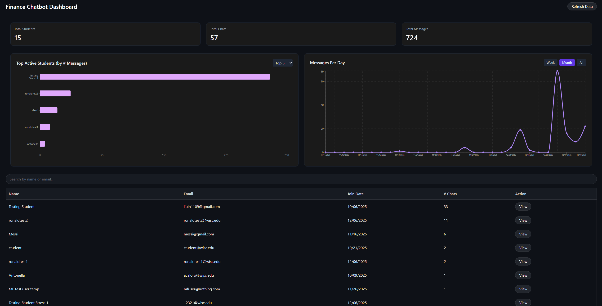
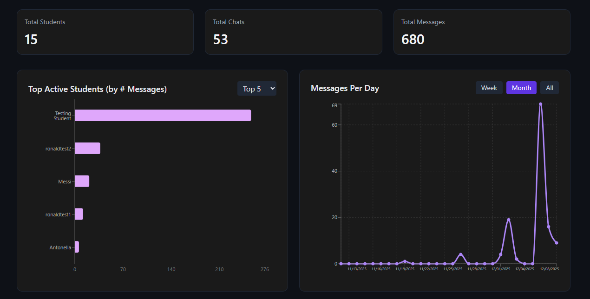
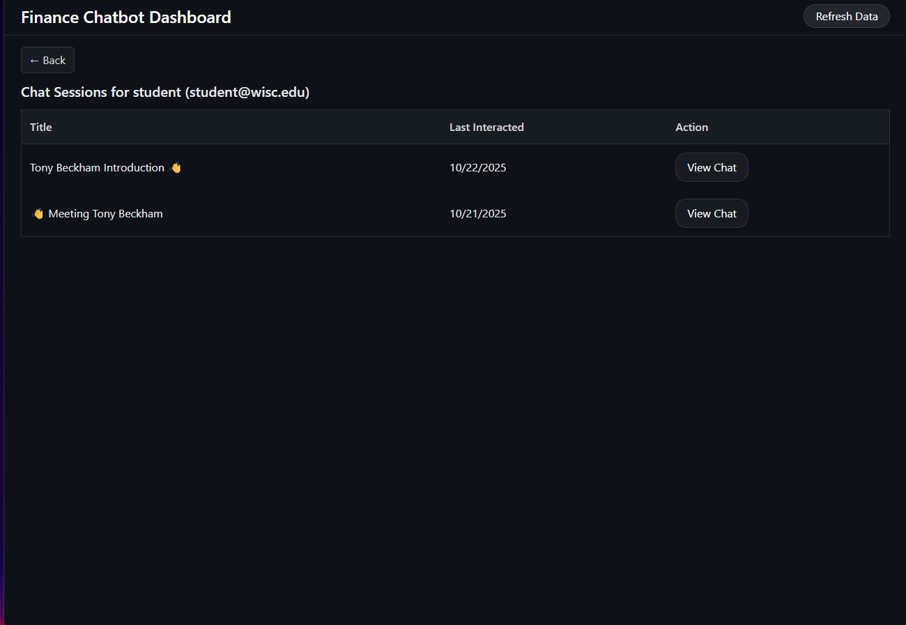
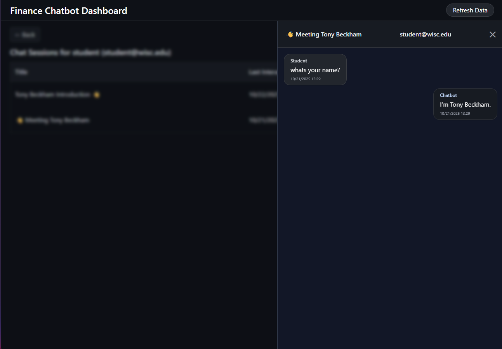

# Grading Dashboard
A FastAPI + React dashboard that extracts, processes, and visualizes student chatbot interactions for grading and analytics.

## Overview 

This dashboard extracts student chat sessions from an OpenWebUI SQLite database and converts them into a structured JSON format.
A FastAPI backend serves analytics and user-level details, while a React frontend visualizes metrics, charts, and chat transcripts.
Instructors can quickly review student interactions, identify patterns, and evaluate performance at scale.

## How the code works (brief)

The backend (FastAPI) reads OpenWebUI SQLite chat data or exported JSON, normalizes sessions into a structured JSON model, and exposes REST endpoints for aggregated metrics and per-user chat history. The frontend (React + Vite) consumes these endpoints to render metric cards, charts, paginated user lists, and a sliding drawer with chat transcripts. The backend performs light processing/aggregation (counts, chats-per-day, top users) and serves the data to the UI.

## Features

**Backend (FastAPI)**

* `/users` → returns all students with aggregated chat data

* `/user/{id}` → returns full chat history for a specific student

* Organized directory structure 
  
**Frontend (React + Vite)**

* Metric cards (Total students, chats, messages)
* Top-Users chart
* Chats-per-day visualization
* Search for users
* Pagination for users + chats
* Sliding drawer for transcripts

## How to Run

Run command: `./run_app.sh`

**Requirements**
Here’s a cleaner, clearer version you can drop into your README. It keeps the same content but improves flow, structure, and readability.

---

## How to Run

Run the app with
`./run_app.sh`

### Requirements

#### Backend

* Python 3.10 or higher
  * Windows users can install it from the official Python site
  * Linux and macOS users should install it using their system package manager

* Environment variables

  * Copy the example file: `mv .env.example .env`
  * Update the database names and any other required variables

#### Frontend
* Node.js v20.19.5
* npm 10.8.2
* Note: If these are not installed, see the installation notes in the [Frontend Readme](./frontend/README.md) folder.

## Images of the dashboard

### Dashboard Home

### Top Users Chart

### User Detail Page

### Chat Transcript Drawer

## Notes

This project is part of the ongoing work to support instructors in evaluating student chatbot interactions.  
Future improvements will include enhanced filtering, improved analytics, and optional database storage.

## Usage

This project is intended for academic use.  