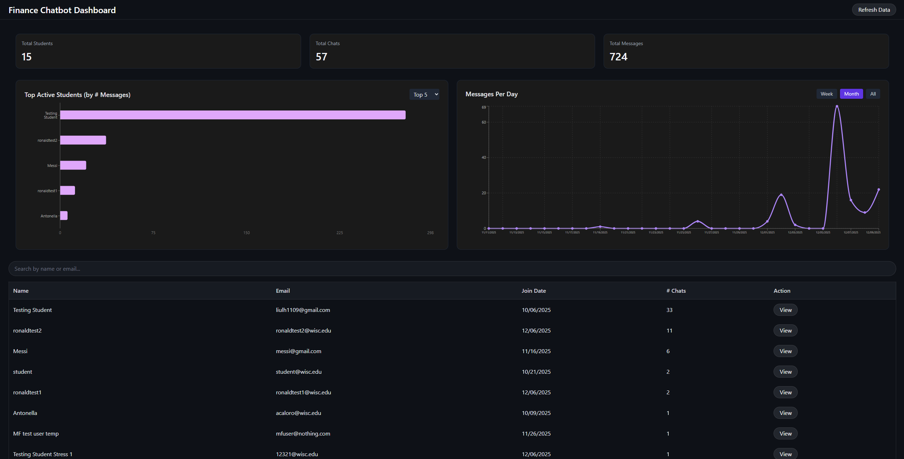
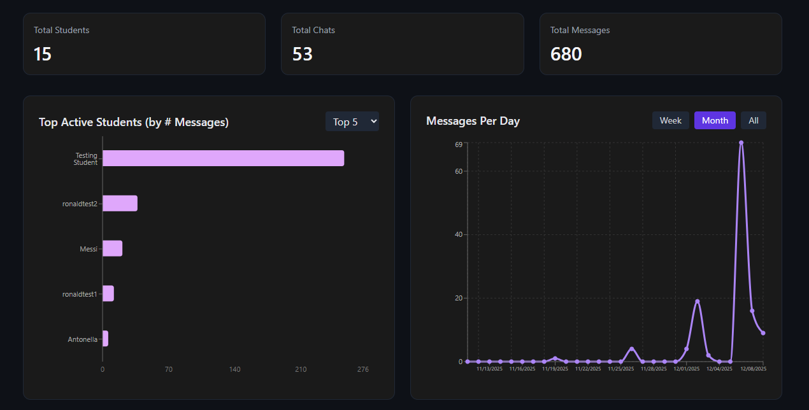
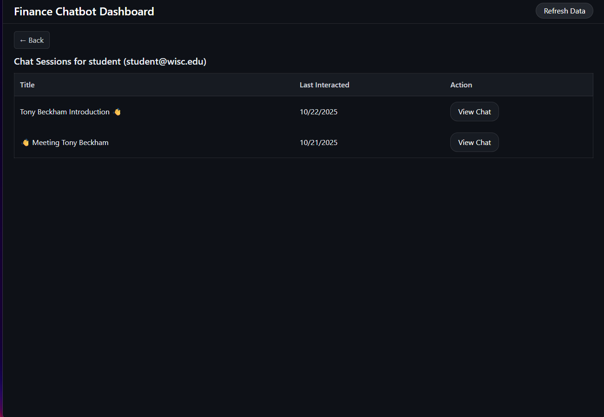
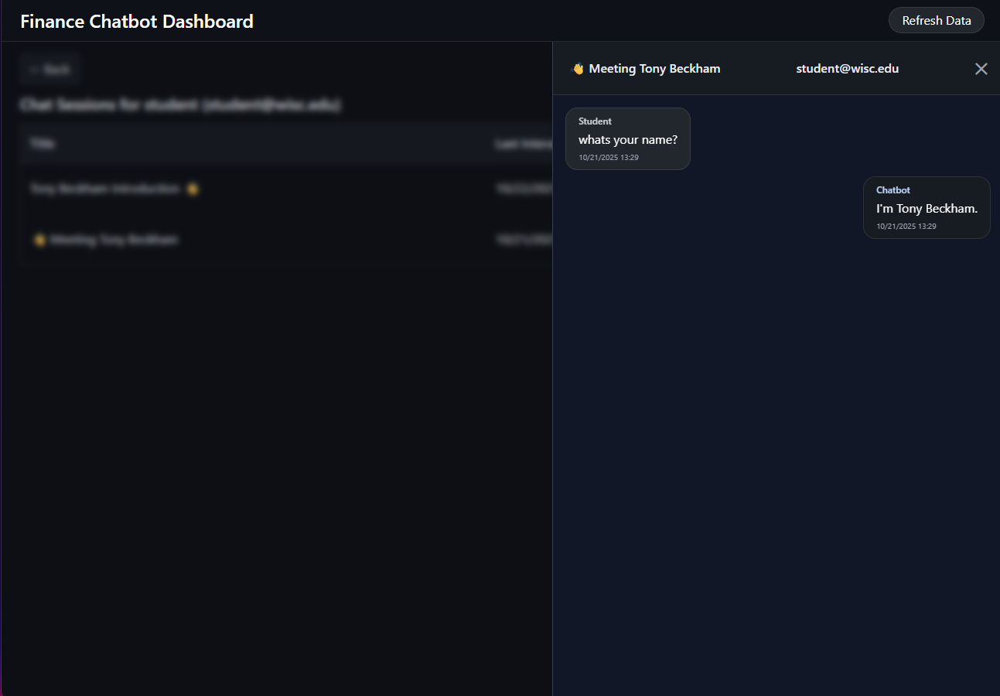

# Grading Dashboard
A FastAPI + React dashboard that extracts, processes, and visualizes student chatbot interactions for grading and analytics.

## Overview 

This dashboard extracts student chat sessions from an OpenWebUI SQLite database and converts them into a structured JSON format.
A FastAPI backend serves analytics and user-level details, while a React frontend visualizes metrics, charts, and chat transcripts.
Instructors can quickly review student interactions, identify patterns, and evaluate performance at scale.

## How the code works (brief)

The backend (FastAPI) reads OpenWebUI SQLite chat data or exported JSON, normalizes sessions into a structured JSON model, and exposes REST endpoints for aggregated metrics and per-user chat history. The frontend (React + Vite) consumes these endpoints to render metric cards, charts, paginated user lists, and a sliding drawer with chat transcripts. The backend performs light processing/aggregation (counts, chats-per-day, top users) and serves the data to the UI.

## Features

**Backend (FastAPI)**

* `/users` → returns all students with aggregated chat data

* `/user/{id}` → returns full chat history for a specific student

* Organized directory structure 
  
**Frontend (React + Vite)**

* Metric cards (Total students, chats, messages)
* Top-Users chart
* Chats-per-day visualization
* Search for users
* Pagination for users + chats
* Sliding drawer for transcripts

## How to Run

Run command: `./run_app.sh`

**Requirements**
Here’s a cleaner, clearer version you can drop into your README. It keeps the same content but improves flow, structure, and readability.

---

## How to Run

Run the app with
`./run_app.sh`

### Requirements

#### Backend

* Python 3.10 or higher
  * Windows users can install it from the official Python site
  * Linux and macOS users should install it using their system package manager

* Environment variables

  * Copy the example file: `mv .env.example .env`
  * Update the database names and any other required variables

#### Frontend
* Node.js v20.19.5
* npm 10.8.2
* Note: If these are not installed, see the installation notes in the [Frontend Readme](./frontend/README.md) folder.

## Images of the dashboard

### Dashboard Home

### Top Users Chart

### User Detail Page

### Chat Transcript Drawer

## Notes

This project is part of the ongoing work to support instructors in evaluating student chatbot interactions.  
Future improvements will include enhanced filtering, improved analytics, and optional database storage.

## ABI Pipeline (Scoring Mode)

The scoring view includes an optional ABI pipeline.
ABI stands for Ability, Benevolence, and Integrity.

When ABI is enabled, each extracted student question is first scored on rubric dimensions (0 to 2), then mapped to trust-style indicators:

* Ability: competence and quality of financial questioning behavior
* Benevolence: signs of care, respect, and client-centered questioning
* Integrity: ethical and non-manipulative questioning behavior

### How ABI is computed

1. Rubric dimensions are scored per question (0 to 2).
2. Values are normalized to 0 to 1.
3. Twelve sub-dimensions are estimated from rubric signals.
4. Weighted formulas produce Ability, Benevolence, and Integrity.
5. ABI total is the average of the three:

$$
ABI\ Total = \frac{Ability + Benevolence + Integrity}{3}
$$

### Why it is useful

The base rubric captures question quality.
ABI adds a trust-oriented lens that helps instructors distinguish between:

* technically strong but potentially risky questioning behavior
* polite but weakly focused questioning behavior
* balanced, high-trust interviewing behavior

### Reading results in practice

* High Ability + low Integrity: strong technical quality but possible ethical concerns
* High Benevolence + low Ability: respectful tone but weak depth or specificity
* Balanced high ABI: strong quality and trustworthy behavior across dimensions

### API behavior

The unified backend endpoint accepts ABI mode in scoring requests:

* `POST /api/score` with `useAbi: true` returns per-question ABI plus aggregated ABI summaries.

## Usage

This project is intended for academic use.  

## Refresh Hardening And Operational Checks

The refresh endpoint now returns structured success metadata and fails with HTTP 500 when extraction or export fails.

### Structured refresh success response

`GET /refresh` returns JSON with:

* `status`
* `message`
* `refresh_metadata.users_processed`
* `refresh_metadata.chat_entries_processed`
* `refresh_metadata.message_pairs_processed`
* `refresh_metadata.latest_message_timestamp_found`
* `refresh_metadata.output_file_path`
* `refresh_metadata.malformed_chat_rows_skipped`

### Role filter configuration

By default, extractor refresh includes only student accounts (`role=user`).

Configure `EXTRACT_USER_ROLES` in your `.env`:

* `EXTRACT_USER_ROLES=user` (default)
* `EXTRACT_USER_ROLES=user,admin` (include both students and admins)
* `EXTRACT_USER_ROLES=all` (no role filtering)

### Failure behavior

If extraction or JSON export fails, `GET /refresh` responds with HTTP 500 and detail:

* `status: error`
* `message`
* `error`
* `error_type`

### Operational checks

1. Verify DB path and output path use the correct mounted volume:
  * Set `DB_PATH` and `OUTPUT_PATH` in your local environment file.
  * Confirm paths resolve to your mounted project/storage volume.
2. Verify backend write permissions:
  * Confirm backend process user can create and replace files in the `OUTPUT_PATH` directory.
  * The exporter uses atomic write (`temp file + os.replace`), so directory write and rename permissions are required.
3. Confirm latest data is included after refresh:
  * Run `GET /refresh` and read `refresh_metadata.latest_message_timestamp_found`.
  * Compare `refresh_metadata.output_file_path` file modification time with refresh time.
  * Validate counts (`users_processed`, `chat_entries_processed`, `message_pairs_processed`) match expected recent source activity.