# Decoupling FamilyFinanceChat from OpenWebUI Internals

## Problem Statement

The current architecture **replaces 3 core OpenWebUI files** via Docker bind mounts:

- [custom-code/main.py](custom-code/main.py) (2,518 lines) -- a full fork of OpenWebUI's FastAPI entrypoint
- [custom-code/config.py](custom-code/config.py) (3,876 lines) -- a full fork of OpenWebUI's config module
- [custom-code/observability.py](custom-code/observability.py) (174 lines) -- custom Prometheus metrics

Plus it injects [custom_pdf_router.py](custom-code/integrated_backend/custom_pdf_router.py) into OpenWebUI's routers directory, importing 5 internal modules.

This means **any** OpenWebUI upgrade requires manually diffing and re-merging ~6,500 lines of forked code. The project is pinned to v0.6.41 while the current stable is v0.8.12.

## Priorities (Refined)

1. **Knowledge Base management must work across OW versions** -- both uploading new files to KBs and preserving existing KB data through upgrades
2. **Chat-stage metrics must be preserved** -- per-stage timing (RAG processing, LLM inference), token counts, context length
3. **Grading dashboard must keep working** -- `extract_chats.py` reads the OW database to power the professor grading UI
4. **PDF crawler is not needed** -- can be dropped entirely
5. **API-level Prometheus metrics can be dropped** -- cadvisor already covers infrastructure-level monitoring

## What Can Be Dropped vs. What Must Be Kept


| Component                                       | Status            | Reason                                                         |
| ----------------------------------------------- | ----------------- | -------------------------------------------------------------- |
| Forked `main.py` (2,518 lines)                  | **DROP**          | Only needed to mount custom router + inject metrics middleware |
| Forked `config.py` (3,876 lines)                | **DROP**          | Only needed to support imports in forked main.py               |
| `observability.py` (174 lines)                  | **DROP**          | Metric definitions move into a Filter Function                 |
| `custom_pdf_router.py` + bookmarklet            | **DROP**          | PDF crawler not needed; KB upload done via native OW UI        |
| Chat stage metrics (lines 1727-1794 of main.py) | **KEEP**          | Migrate to an OpenWebUI Filter Function                        |
| API-level prometheus_middleware                 | **DROP**          | cadvisor covers this                                           |
| Hybrid search flag shim                         | **DROP**          | Unnecessary on versions past v0.6.41                           |
| `extract_chats.py` SQLite reads                 | **KEEP + HARDEN** | Migrate from raw SQLite to OW public API                       |
| `tools/kb_sync/`                                | **KEEP**          | Already uses public REST API, upgrade-safe                     |


## Proposed Architecture

```mermaid
graph TB
    subgraph current ["Current: Vendor Fork (v0.6.41 only)"]
        OW_old["OpenWebUI v0.6.41"]
        Fork["Forked main.py + config.py + observability.py<br/>(6,500 lines bind-mounted)"]
        Router["custom_pdf_router.py<br/>(injected into OW routers)"]
        SQLite["Direct SQLite reads<br/>(extract_chats.py)"]
        OW_old --> Fork
        Fork --> Router
        OW_old -.->|"fragile DB access"| SQLite
    end

    subgraph proposed ["Proposed: Decoupled (any OW version)"]
        OW_new["OpenWebUI (unmodified, any version)"]
        Filter["Filter Function<br/>(chat metrics, installed via OW admin UI)"]
        Pushgateway["Prometheus Pushgateway"]
        Grafana["Grafana Dashboards"]
        GradingAPI["extract_chats.py<br/>(uses OW public REST API)"]
        NativeKB["Native OW Knowledge Base UI<br/>+ tools/kb_sync CLI"]

        OW_new -->|"official plugin API"| Filter
        Filter -->|"push metrics"| Pushgateway
        Pushgateway --> Grafana
        OW_new -->|"GET /api/v1/chats, /users"| GradingAPI
        NativeKB -->|"native UI + REST API"| OW_new
    end
```




### Layer 1: Knowledge Base Management (no custom code needed)

OpenWebUI's native UI already supports everything the custom PDF router did for KB management:

- **Upload files**: Workspace > Knowledge > drag-and-drop files, or use the file upload button
- **Programmatic upload**: `POST /api/v1/files/` then `POST /api/v1/knowledge/{id}/file/add` (documented in [OW docs](https://docs.openwebui.com/features/ai-knowledge/knowledge/))
- **Bulk sync**: The existing [tools/kb_sync/](tools/kb_sync/) CLI already does this via the public API
- **Data migration**: OW runs Alembic migrations automatically on startup; KB data (files + Qdrant embeddings) persists across upgrades as long as volumes are preserved

The entire `custom_pdf_router.py`, bookmarklet, and `upload_pdf_app/` can be retired.

### Layer 2: Chat Metrics via Filter Function (replaces forked main.py + observability.py)

Create an OpenWebUI **Filter Function** that captures the same chat-stage metrics currently injected into `main.py` lines 1727-1794. Filter Functions are the official plugin mechanism -- they survive upgrades and require zero source modifications.

**How it works:**

- **Inlet** (runs before LLM call): Records start time, captures message count and estimated token count
- **Outlet** (runs after LLM response): Calculates elapsed time, extracts usage tokens from response, pushes all metrics to a Prometheus Pushgateway

**Metrics preserved:**

- `CHAT_PAYLOAD_LATENCY` -- time spent in RAG/payload processing (inlet timing)
- `LLM_COMPLETION` -- LLM inference duration (outlet - inlet delta)
- `PROMPT_TOKENS` / `COMPLETION_TOKENS` -- from response usage object
- `CHAT_CONTEXT_LENGTH` / `CONTEXT_TOKENS` -- message count and estimated tokens

**Metrics dropped (acceptable):**

- `API_LATENCY`, `API_ERRORS`, `REQUESTS_IN_FLIGHT` -- covered by cadvisor
- `STAGE_LATENCY` for `context_assembly` -- trivial sub-millisecond measurement
- `RAG_REQUEST_LATENCY`, `RAG_ERRORS` -- internal RAG middleware metrics

**Trade-off**: A Filter Function cannot measure the exact boundary between "payload processing" and "LLM inference" the way the forked main.py can (since it wraps the entire `process_chat_payload` call). The inlet/outlet boundary gives us total round-trip time and LLM time, but the RAG processing time becomes `total - LLM`. This is a reasonable approximation.

**Implementation**: The Filter Function is a single Python file installed through OW's Admin > Functions UI. It uses `prometheus_client` to push to a Pushgateway container on `ai-net`. Example skeleton:

```python
class Filter:
    class Valves(BaseModel):
        pushgateway_url: str = "http://pushgateway:9091"

    def inlet(self, body, __user__, __request__):
        body["__metrics_start"] = time.perf_counter()
        body["__metrics_msg_count"] = len(body.get("messages", []))
        return body

    def outlet(self, body, __user__, __request__):
        start = body.pop("__metrics_start", None)
        if start:
            duration = time.perf_counter() - start
            # push to pushgateway: chat_completion_seconds, token counts, etc.
        return body
```

### Layer 3: Grading Data Extraction via Public API (replaces direct SQLite reads)

[extract_chats.py](grading_feature/backend/extract_chats.py) currently reads OpenWebUI's SQLite DB directly:

```python
# Current fragile queries:
"SELECT id, email, name, role, created_at FROM user"
"SELECT chat FROM chat WHERE user_id = ?"
```

These table names, column names, and the JSON blob structure inside `chat.chat` can change across OW versions. Migrate to OpenWebUI's public REST API:


| Current SQLite Query                      | Public API Replacement                                             |
| ----------------------------------------- | ------------------------------------------------------------------ |
| `SELECT ... FROM user`                    | `GET /api/v1/users/` (admin endpoint, returns user list)           |
| `SELECT chat FROM chat WHERE user_id = ?` | `GET /api/v1/chats/list/user/{user_id}` or `GET /api/v1/chats/all` |
| Parse `chat.chat` JSON blob for messages  | Response already includes structured `chat.messages`               |


**Key benefit**: The public API returns a stable, documented JSON structure. Even if the internal DB schema changes, the API contract is maintained across versions.

**Auth**: The grading tool needs an admin API key (created in OW Settings > Account > API Keys). This replaces the SSH tunnel + SQLite file copy workflow.

**Fallback**: If a specific OW version's API doesn't return all needed fields, the SQLite approach can remain as a fallback with a version-detection wrapper. But the API path should be the primary.

## Migration Steps

### Phase 1: Build the Filter Function for Chat Metrics

- Write the Filter Function Python file with inlet/outlet hooks
- Add a Prometheus Pushgateway container to `docker-compose.yml`
- Update `prometheus.yml` to scrape the pushgateway
- Install the function via OW Admin UI (or via API: `POST /api/v1/functions/create`)
- Verify metrics appear in Grafana; update dashboard queries if metric names changed

### Phase 2: Migrate Grading Extraction to Public API

- Refactor `extract_chats.py` to use `httpx` / `requests` against OW's REST API instead of `sqlite3`
- Add `OPENWEBUI_API_KEY` and `OPENWEBUI_BASE_URL` env vars to `grading_feature/.env`
- Keep the SQLite path as a fallback behind a `--legacy` flag for transition period
- Test with the grading dashboard to confirm data parity

### Phase 3: Remove the Vendor Fork

- Remove all 5 bind-mount lines from `docker-compose.yml` and `docker-compose.staging.yml`:
  - `main.py:/app/backend/open_webui/main.py`
  - `custom-code:/app/custom-code`
  - `custom_pdf_router.py:/app/backend/open_webui/routers/custom_pdf_router.py`
  - `config.py:/app/backend/open_webui/config.py`
  - `observability.py:/app/backend/open_webui/observability.py`
- Update `Dockerfile` from `ghcr.io/open-webui/open-webui:v0.6.41` to a newer version (e.g., `v0.8.12`)
- Remove `pip install PyMuPDF prometheus-client` from Dockerfile (no longer needed in OW container)
- Archive `custom-code/` directory (don't delete -- keep as reference)

### Phase 4: Validate

- Test KB upload via native OW UI and via `tools/kb_sync`
- Verify existing KB data (files + Qdrant embeddings) survived the version upgrade
- Confirm chat metrics flow: Filter Function -> Pushgateway -> Prometheus -> Grafana
- Confirm grading dashboard: `extract_chats.py` -> OW API -> JSON -> React frontend
- Run `scoring_page` against an exported chat JSON to verify format compatibility

## Risk Assessment


| Risk                                                     | Likelihood | Mitigation                                                                                                                                     |
| -------------------------------------------------------- | ---------- | ---------------------------------------------------------------------------------------------------------------------------------------------- |
| KB data lost during OW upgrade                           | Low        | OW runs Alembic migrations automatically; Qdrant data is in a separate volume. Back up `/app/backend/data` and Qdrant volume before upgrading. |
| Filter Function can't measure RAG vs LLM split precisely | Medium     | Acceptable trade-off: we get total time and can infer RAG time. If needed, OW v0.8+ has built-in analytics.                                    |
| OW public API changes for chat/user endpoints            | Low        | Public APIs are versioned and more stable than internals. Pin to known-good response shapes.                                                   |
| `extract_chats.py` API migration misses edge cases       | Medium     | Keep SQLite fallback behind `--legacy` flag during transition. Compare outputs.                                                                |
| Grafana dashboards break due to metric name changes      | Medium     | Update dashboard JSON alongside the filter function. Document metric name mapping.                                                             |
| OW v0.8 has breaking changes we haven't anticipated      | Medium     | Test on staging first (`docker-compose.staging.yml`). The staging environment already exists for this purpose.                                 |


## What Gets Preserved

- Knowledge Base file upload and management (via native OW UI + `tools/kb_sync`)
- Existing KB data (files, embeddings) across upgrades
- Chat-stage Prometheus metrics (payload processing, LLM inference, token counts) via Filter Function
- Grafana dashboards (with updated data source)
- Grading dashboard (professor chat review)
- Scoring page (chat quality scoring)

## What Gets Dropped

- The forked `main.py`, `config.py`, `observability.py` (6,500 lines of maintenance burden)
- `custom_pdf_router.py` and the bookmarklet (PDF crawler not needed)
- `upload_pdf_app/` standalone uploader (superseded by native OW UI)
- API-level Prometheus metrics (cadvisor covers this)
- Hybrid search flag shim (unnecessary on newer OW versions)
- Direct `open_webui.`* Python imports (zero remaining)

